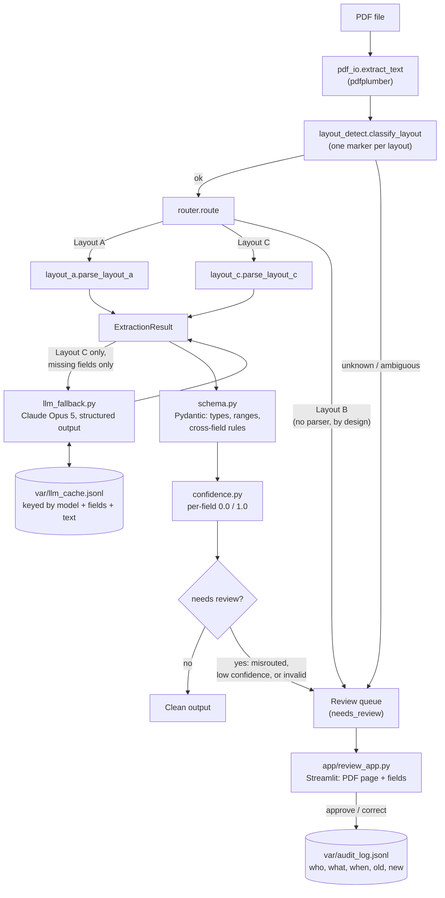

# Project 2 — Document Extraction (Stage 1–5, complete)

Elevator inspection certificates arrive as PDFs in three different layouts,
and a naive parser either breaks on the layout it wasn't built for or —
worse — silently returns a wrong value that nobody catches. This project
turns that corpus into structured data you can actually trust: extract
deterministically wherever a regex will do (cheaper, faster, and far more
debuggable than a model call), validate every field against real business
rules, route anything uncertain to a human review queue instead of
guessing, and bring in an LLM only for the one gap the deterministic
parsers can't close — with the accuracy, cost, and latency of that LLM
path measured, not assumed.

Built against the synthetic 36-document, 3-layout corpus described in
[`PROJECT-2-document-extraction.md`](../meridian-portfolio/PROJECT-2-document-extraction.md)
in the sibling `meridian-portfolio` repo. Personal project built for skill
development — no production deployment, no real users, no real inspection
records.



**A deliberate scope boundary: Layout B has no parser, on purpose.** None
of the project's 5 named stages ever assign Layout B one — Stage 1 scopes
Layout A only, Stage 5 scopes Layout C only. Rather than silently drift
past that gap, it's documented here: Layout B is classified correctly
(Stage 2) and always routed to the review queue, every field reported
missing, never guessed. If a Layout B parser gets built later it's a
one-line addition to `router.py`'s `_PARSERS` registry — nothing else
changes.

**Built so far, deliberately in small stages:**

**Stage 1 — deterministic extraction (Layout A).**
- `pdfplumber` reads each PDF's text (`src/extraction/pdf_io.py`).
- A set of regexes pulls out the labeled fields (`src/extraction/layout_a.py`).
- Anything a regex doesn't match comes back as `None` — never a guessed
  value.

**Stage 2 — layout detection and routing.**
- Each of the three layouts has one boilerplate text marker
  (`src/extraction/layout_detect.py`) — verified unique across the full
  36-document corpus: every document matches exactly one marker, never
  zero, never more than one.
- A document is only routed to a parser when classification is
  unambiguous *and* a parser exists for that layout
  (`src/extraction/router.py`). Zero-match (`unknown`) and multi-match
  (`ambiguous`) are distinct, reported outcomes, not silently resolved by
  picking the "closest" layout.
- A routing report (`src/extraction/routing_report.py`) prints every
  document's detected layout next to ground truth and calls out any
  misrouted document by name in its own section.

**Stage 3 — Pydantic schema validation.**
- `InspectionCertificate` (`src/extraction/schema.py`) is the Pydantic
  model every extracted document must satisfy: types (a real `date`, not a
  date-shaped string; `result` restricted to the three known enum values),
  ranges (`invoice_total` and `capacity_lbs` must be positive,
  `defect_count` can't be negative), and two cross-field rules —
  `next_due` must be later than `inspection_date`, and a `FAIL` result
  with zero defects listed is rejected as contradictory.
- `capacity_lbs` is the one field allowed to be `None` — a few Layout C
  documents omit it entirely, and that's a legitimate "missing," not an
  invalid document. Every other field being `None` (a parser miss) fails
  validation rather than passing a hole in the data downstream.
- `validate.py` wraps model construction so a validation failure is a
  reported outcome (`ValidationOutcome.valid`, `.errors`), not an
  exception that stops the run.
- A validation report (`src/extraction/validation_report.py`) routes and
  validates every document, prints per-document status, and lists any
  flagged document's exact errors in its own section.

**Stage 4 — confidence scoring and a review queue.**
- `confidence.py`: for deterministic regex extraction, confidence is
  honestly binary — 1.0 for a field the parser found, 0.0 for one it
  didn't. There's no gradient to hedge with; a real fractional confidence
  arrives with Stage 5's LLM fallback.
- `review_queue.py`: a document is flagged for review if it was misrouted
  (Stage 2), any field is below the confidence threshold — including any
  field that's simply missing — or the extraction fails schema validation
  (Stage 3). Everything not flagged is "clean." `build-review-queue`
  prints the queue and the reasons behind every flagged document.
- `audit_log.py`: an append-only JSONL log (`var/audit_log.jsonl` by
  default, overridable via `EXTRACTION_AUDIT_LOG_PATH`). Every review
  decision — approve or correct — is one line: reviewer, timestamp,
  document, field, old value, new value. Corrections add lines; nothing is
  ever overwritten.
- `app/review_app.py`: a small Streamlit UI. Pick a queued document from
  the sidebar, see its PDF page rendered next to its extracted (or blank)
  field values, edit what needs correcting, and submit. Leaving a field
  blank and submitting logs an explicit "approved as missing," not a
  fabricated empty value.

**Prerequisite work for Stage 5, done ahead of the LLM fallback.**
Stage 5's own wording only makes sense with a deterministic Layout C
parser already in place — it says the LLM fills in "fields the
deterministic parser couldn't get," which presupposes a deterministic
parser doing most of the work already. So:
- `layout_c.py` — a regex parser for Layout C's two-column prose format,
  reaching 100% field accuracy. The one real bug hit building it: the
  preamble sentence's word-wrap point shifts depending on how long the
  inspector's name is (`"...as an\nauthorized inspector"` in most
  documents, `"...as an authorized\ninspector"` in two of them) — a regex
  assuming a fixed wrap point silently returned `None` for three fields
  on exactly those two documents. Fixed by using `\s+` at every join in
  the sentence instead of a literal space, so the match doesn't care
  where the line actually breaks. Covered by
  `test_parses_correctly_regardless_of_which_word_the_preamble_wraps_after`
  in `tests/test_layout_c.py`.
- `models.py` — `ExtractionResult`, one shared dataclass every parser
  returns, replacing the Layout-A-specific `LayoutAResult`. Keeps
  `router.py`, `confidence.py`, `validate.py`, and `review_queue.py`
  layout-agnostic: none of them need to know or care which parser
  produced a given result.
- `accuracy.py` generalized from a Layout-A-only scorer into a per-layout
  one, routing each document for real (via `router.route()`) rather than
  trusting the ground-truth layout column to pick a parser — a routing
  regression would show up as documents dropping out of scoring, not as
  silently wrong numbers. The `report-accuracy` command (renamed from
  `extract-layout-a`, since it's no longer Layout-A-specific) now prints
  a true per-layout, per-field breakdown.
- End-to-end determinism tests added in `tests/test_determinism.py`,
  covering the full pipeline (`route` → `validate_extraction` →
  `evaluate_document`), not just the Stage 1 parser in isolation. This
  was a gap identified before starting Stage 5: nothing tested that the
  whole system, not just one function, reprocesses a PDF identically —
  and Stage 5's LLM call is exactly the kind of thing that can quietly
  break that property if it isn't already pinned down by a test.

**Stage 5 — LLM fallback, measured.**
- Scope, exactly as the project brief states it: **Layout C only**, and
  **only for fields the deterministic parser left `None`.** In practice
  that's one field — `capacity_lbs` — on the 4 of 12 Layout C documents
  where the source PDF genuinely omits it. Every other Layout C field is
  already at 100% (Stage 4's prerequisite work), so there's nothing else
  for the model to do.
- `llm_fallback.py`: calls Claude Opus 5 (`claude-opus-5`) with structured
  output (`output_config.format`, a `json_schema` built per-call from just
  the missing fields) — typed JSON back, not prose to re-parse. The system
  prompt is explicit: return `null` for a field that isn't actually in the
  document; never guess. `resolve_missing_fields()` only ever asks about
  fields that are `None` — the "Layout C only, gap-filling only" constraint
  is enforced in code, not left to caller discipline.
- **Determinism, without `temperature=0`.** Claude Opus 5 rejects
  `temperature` outright (removed on this model tier — sending it 400s).
  Every real response is cached instead, keyed by a hash of (model, prompt
  version, requested fields, document text) in `var/llm_cache.jsonl`. A
  rerun against the same document never calls the API again — a stronger
  guarantee than `temperature=0` ever was, and free after the first run.
  Verified live: rerunning `report-llm-fallback` after the first run costs
  **$0.00** and reproduces the identical result.
- `llm_fallback_report.py` (`report-llm-fallback`) runs the fallback over
  all 12 Layout C documents and reports accuracy with/without the
  fallback, cost per document, and latency per document — the exact
  acceptance criterion.

The LLM fallback module accepts a swappable `caller` function, so
`tests/test_llm_fallback.py` (8 tests) verifies all the merge/cache/coercion
logic against a fake caller with zero network calls and zero cost.
`tests/test_llm_fallback_live.py` (2 tests) hits the real API — but reuses
the same cache key the real report run already populated, so after the
first run it also costs nothing on every subsequent test run.

## Results

Per-layout, per-field accuracy against `GROUND_TRUTH.csv`, all 36 documents
(measured by `tests/test_accuracy.py`):

```
Documents scored: 24
Documents skipped (no parser for that layout): 12 (B=12)

Overall field accuracy (all scored layouts): 100.0%

Layout A - 12 documents, 100.0% overall
Layout C - 12 documents, 100.0% overall
```

Layout routing, all 36 documents (measured by `tests/test_routing_accuracy.py`):

```
Detected layout counts: A=12, B=12, C=12
Routing accuracy vs ground truth: 36/36 (100.0%)

No misrouted documents.
```

Schema validation, all 36 documents (measured by `tests/test_validation_corpus.py`):

```
Valid: 24  Invalid: 0  Skipped: 12
No documents flagged by schema validation.
```

The four Stage 3 rules are proven against mutated copies of a real
extraction in `tests/test_schema.py`, e.g.:

```
FAIL + 0 defects            -> False, "result is FAIL but defect_count is 0 -- contradictory..."
next_due == inspection_date -> False, "next_due (2026-01-13) must be later than inspection_date (2026-01-13)"
negative invoice_total      -> False, "Input should be greater than 0"
```

Review queue, all 36 documents (measured by `tests/test_review_queue.py`):

```
36 documents evaluated: 20 clean, 16 need review
```

- **20 clean**: 12 Layout A + 8 Layout C (the ones with `capacity_lbs`
  present) — fully populated, fully validated, every field at full
  confidence.
- **16 in the review queue**: 12 Layout B (no parser — the deliberate
  scope boundary above) + **4 Layout C documents, flagged specifically
  and only for their missing `capacity_lbs`** — the exact acceptance
  criterion the project doc is built around: *"Every missing-capacity
  document lands in the review queue; none receives a fabricated value."*
  Before the Layout C parser existed, this held only by accident (nothing
  in Layout C was extracted at all); now it holds for the right reason.

LLM fallback, all 12 Layout C documents (measured live against the real
Claude API — not simulated — via `report-llm-fallback`):

```
Layout C documents: 12
Documents needing the LLM fallback (a field was missing): 4
  of which made a fresh API call: 4

Field accuracy WITHOUT fallback (deterministic parser only): 100.0%
Field accuracy WITH fallback:                                100.0%

Total cost this run: $0.01681
Cost per document needing the fallback: $0.00420
Cost per document across all of Layout C: $0.00140
Average latency per fresh API call: 3.17s
```

**The finding — as the project doc says to expect, whatever it turns out
to be:** the LLM fallback made no accuracy difference here. Not because it
didn't run — it made 4 real API calls, at ~$0.004 and ~3 seconds each —
but because the deterministic parser had already reached 100% on every
obtainable field, and the 4 missing-capacity documents are missing
`capacity_lbs` because the *source PDF* omits it, not because the parser
failed. Asked directly, the model correctly returned `null` for all 4
rather than inventing a plausible weight. That's the actual result: the
LLM path is proven safe (it never fabricated a value) and proven
unnecessary on this corpus (nothing was left to extract) — both facts
measured, not assumed. Rerunning the same command afterward costs **$0.00**
— every one of those 4 answers is now cached. (Reproduced twice on two
separate live runs with two different API keys, a few cents apart each
time — the accuracy result and the "never fabricates" behavior held
identically both times; only the exact cost/latency figures moved with
normal API variance.)

## Setup

```powershell
python -m venv .venv
.venv\Scripts\pip install -e ".[dev]"

# to also run the Streamlit review UI:
.venv\Scripts\pip install -e ".[ui]"

# to also run the Stage 5 LLM fallback (needs ANTHROPIC_API_KEY in .env):
.venv\Scripts\pip install -e ".[llm]"
```

`.env` (git-ignored) must contain:

```
ANTHROPIC_API_KEY=sk-ant-...
```

## Run

```powershell
# per-layout, per-field accuracy report
.venv\Scripts\report-accuracy

# layout classification + routing report, all 36 documents
.venv\Scripts\route-documents

# schema validation report, all 36 documents
.venv\Scripts\validate-documents

# review queue report (who needs review and why)
.venv\Scripts\build-review-queue

# the review UI itself (requires the "ui" extra)
.venv\Scripts\streamlit run app\review_app.py

# Stage 5: LLM fallback report over all 12 Layout C documents (requires "llm" extra + .env)
.venv\Scripts\report-llm-fallback

# any report command can point at a different corpus with the same GROUND_TRUTH.csv shape
.venv\Scripts\python -m extraction.cli path\to\other\sample-data
.venv\Scripts\python -m extraction.routing_report path\to\other\sample-data
.venv\Scripts\python -m extraction.validation_report path\to\other\sample-data
.venv\Scripts\python -m extraction.review_queue path\to\other\sample-data
.venv\Scripts\python -m extraction.llm_fallback_report path\to\other\sample-data

# tests (Streamlit UI / LLM live tests are skipped automatically if their extras
# or ANTHROPIC_API_KEY aren't available)
.venv\Scripts\pytest -q
```

## Layout

```
src/extraction/
  pdf_io.py         # pdfplumber wrapper: PDF -> text
  models.py         # ExtractionResult: the one result type every parser returns
  layout_a.py       # regex extraction for Layout A
  layout_c.py       # regex extraction for Layout C (two-column prose)
  accuracy.py       # per-layout, per-field scoring against GROUND_TRUTH.csv
  cli.py            # entry point: report-accuracy
  layout_detect.py  # marker-based classify_layout(text) -> A/B/C/unknown/ambiguous
  router.py         # route(text) -> classification + parser result (or explicit "no parser")
  routing_report.py # entry point: route-documents
  schema.py          # InspectionCertificate Pydantic model: types, ranges, cross-field rules
  validate.py         # validate_extraction(result) -> ValidationOutcome, never raises
  validation_report.py # entry point: validate-documents
  confidence.py        # field_confidences(result) -> per-field 0.0/1.0
  audit_log.py          # append-only JSONL log of review decisions
  review_queue.py        # combines routing + confidence + validation -> QueueItem list; entry point: build-review-queue
  llm_fallback.py          # Stage 5: Claude Opus 5 structured-output fallback + JSONL response cache
  llm_fallback_report.py    # entry point: report-llm-fallback
app/
  review_app.py          # Streamlit review UI: streamlit run app/review_app.py
tests/
  test_layout_a.py          # unit tests against synthetic Layout A text
  test_layout_c.py          # unit tests against synthetic Layout C text, incl. both wrap-point variants
  test_determinism.py       # same PDF in twice -> identical result out, Stage 1 through full pipeline
  test_accuracy.py          # end-to-end: 100% on both scored layouts, B correctly reported as skipped
  test_layout_detect.py     # unit tests: ok/unknown/ambiguous classification
  test_router.py            # unit tests: routing for A and C, "no parser" for B
  test_routing_accuracy.py  # end-to-end: 100% routing accuracy on all 36 real documents
  test_schema.py            # unit tests: every type/range/cross-field rule, both ways
  test_validate.py          # unit tests: validate_extraction wrapping + error surfacing
  test_validation_corpus.py # end-to-end: all 24 real A+C extractions pass validation
  test_confidence.py        # unit tests: binary per-field confidence
  test_audit_log.py         # unit tests: append/read, approve vs correct, per-file filtering
  test_review_queue.py      # unit tests + end-to-end: 20 clean / 16 review on the real corpus
  test_review_app.py        # Streamlit AppTest: loads, lists queue, submits, writes audit log
  test_llm_fallback.py      # unit tests against a fake caller: merge/cache/coercion, zero network cost
  test_llm_fallback_live.py # 2 tests against the real Claude API; skipped without ANTHROPIC_API_KEY
sample-data/inspection-certs/   # 36 PDFs + GROUND_TRUTH.csv (copied in so
                                 # this repo is self-contained; source of
                                 # truth is meridian-portfolio/sample-data)
var/                             # gitignored: audit_log.jsonl and llm_cache.jsonl live here
```

## Design notes

- `ExtractionResult` (`models.py`) field names match `GROUND_TRUTH.csv`
  columns 1:1 so scoring stays a plain per-field `==`, regardless of which
  layout's parser produced the result.
- Both parsers take a `str`, not a file path — deterministic and trivially
  testable without touching a PDF. `pdf_io.extract_text` is the only thing
  that touches pdfplumber.
- `route()` deliberately returns `result=None` for anything not cleanly
  routed to a working parser (unknown layout, ambiguous marker match, or a
  layout with no parser — currently just B), all exposed as
  `routed.misrouted`.
- `_PARSERS` in `router.py` is the only place that needs to change when a
  new layout gets a parser — routing, classification, scoring, and
  reporting all pick it up automatically.
- `ValidationOutcome.valid`, `routed.misrouted`, and per-field confidence
  are the three inputs `review_queue.evaluate_document` combines into one
  `needs_review` decision. Stage 5 deliberately left this alone: the LLM
  fallback lives in its own module (`llm_fallback.py`) and reporting script
  rather than feeding back into `confidence.py` or the review queue. That
  keeps the "accuracy with vs. without the fallback" comparison clean — the
  review queue's numbers describe the deterministic pipeline only, and
  `report-llm-fallback` is the one place the LLM's effect is measured. If a
  future stage wants the fallback's answers to actually reach the clean
  output, the natural seam is exactly that Stage 4 already built: run
  `resolve_missing_fields` before `evaluate_document`, and let confidence
  scoring treat an LLM-filled field the same as a parser-filled one.
- `record_review` logs every field the reviewer saw, not just the ones
  they changed — a blank field left blank still gets an `approve` entry
  (`old_value=None, new_value=None`), which is what makes "this document
  was reviewed and nothing was fabricated" independently verifiable from
  the log later.
- The wrap-point bug in `layout_c.py` was the concrete argument for why
  Stage 5's LLM fallback only runs on fields the deterministic parser
  actually left `None`, not on every Layout C field — the deterministic
  parser, once fixed, is both cheaper and proven at 100% on the real
  corpus. What that argument predicted is exactly what the measurement
  showed: the fallback made 4 real calls and changed 0 field values.

## What I'd do differently

- **Build Layout B too, or cut the "3-layout" framing.** Leaving it
  unparsed is defensible — none of the project's 5 stages ever assign it a
  parser — but it means the per-layout accuracy report only ever speaks
  for 2 of the 3 layouts, and the résumé line "36-document, 3-layout
  corpus" is doing more work than the pipeline actually does. I'd either
  spend the small amount of extra time to give B a deterministic parser
  (it's table-style, not fundamentally harder than A or C) or be more
  explicit up front, before building anything, that the third layout is
  scope-boundaried rather than discovering that gap in an after-the-fact
  audit.
- **Test the Layout C parser against more than a handful of samples before
  calling it done.** The wrap-point bug — a regex that assumed the preamble
  sentence always breaks after the same word — only showed up because 2 of
  the 12 real documents happened to wrap differently, and I only caught it
  by running the parser against the *entire* real corpus and reading every
  mismatch, not by eyeballing 3 sample PDFs and trusting the pattern. That
  should be the default habit for every new parser, not a debugging step
  reached for after something breaks.
- **Stress-test the LLM fallback on a field it actually has to extract.**
  Every real missing field in this corpus is `capacity_lbs`, and the
  correct answer for all 4 cases is "confirm it's genuinely absent." That
  proves the "never fabricate" property, which matters most — but it never
  exercises the case where the model has to find a value that's really
  there, just phrased awkwardly. I'd manufacture at least one synthetic
  document where a different field is deterministically unparseable but
  recoverable from context, so the fallback's *positive* case is measured
  too, not just its refusal case.
- **Give the LLM cache a real invalidation story.** `PROMPT_VERSION` is a
  manual bump — if I change the prompt and forget to bump it, stale
  answers get served silently. Fine for a 12-document corpus checked by
  hand; not fine at any real scale. A content hash of the prompt template
  itself (instead of a hand-maintained version string) would make that
  class of bug structurally impossible instead of relying on discipline.
- **Decide up front whether the LLM fallback feeds the clean output, not
  after the fact.** Stage 5 measures the fallback in its own report but
  never wires its answers back into `confidence.py` or the review queue —
  a deliberate choice to keep the "with vs. without" comparison honest, but
  it means a document the LLM successfully resolved still shows up in the
  review queue today. That's the right call for *measuring* Stage 5, but
  if this were headed to real usage I'd have designed the confidence model
  to accept a fractional, LLM-sourced score from the start, rather than
  treating "wire it in" as a followup.
- **Handle the `.env` file more carefully from the first attempt.** Fixing
  its format took two tries because an early command printed the raw API
  key into the conversation before I'd built a redact-by-default habit for
  anything that touches a secrets file. The fix itself (structural checks —
  key name, value length, a change-hash — never the value) is the right
  pattern; I'd just want it to be the *first* instinct next time a file
  might contain a credential, not the second.
